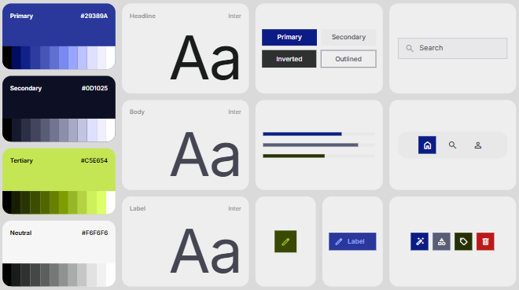
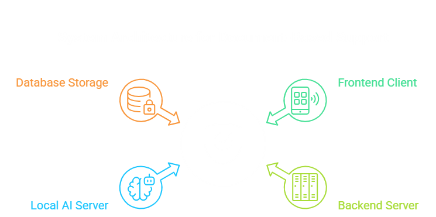
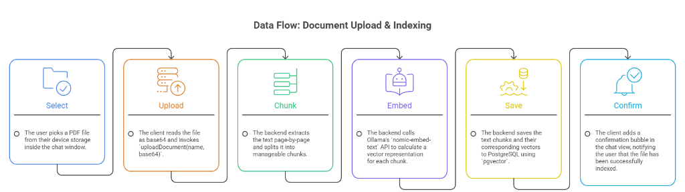
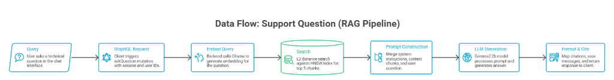

# 🛡️ KnowledgeBot Support Assistant

[](https://reactnative.dev/)
[](https://graphql.org/)
[](https://www.postgresql.org/)
[](https://ollama.com/)
[](https://opensource.org/licenses/MIT)

An advanced, offline-first local **RAG (Retrieval-Augmented Generation)** customer support mobile application. *(For example, configured to parse and answer queries using ConnectWise support documentation).*

The system runs **100% locally** on your machine—ensuring complete data privacy, offline capabilities, and zero API usage costs.

---

## 🎬 Application Demo

<p align="center">
  
</p>

---

### 🎨 Color Palette Mockup Example


---

## 🛠️ Tech Stack & Architecture

### System Components Diagram


### Component Breakdown
*   **Frontend Client (Expo App)**: Built with React Native Expo (SDK 51), featuring a complete navigation stack, React Query caching, and custom markdown support. It includes a native **PDF document picker** that reads and uploads files as base64 streams directly inside active chat bubbles.
*   **Backend Server (Node.js & Express)**: Serves as the middle layer, hosting PostGraphile middleware to dynamically reflect database schemas as GraphQL schemas, and custom Express REST endpoints for user authentication.
*   **GraphQL Schema Plugin**: Custom PostGraphile plugin extending the schema with high-performance `askQuestion` (RAG pipeline) and `uploadDocument` mutations.
*   **Vector Database (PostgreSQL 17)**: Core database managing tables for users, chat sessions, and messages. Employs the `pgvector` extension to index 768-dimension text chunk embeddings using a high-speed **HNSW index** optimized for L2 distance matching.
*   **Local AI Server (Ollama)**: Houses offline generative and embedding runners:
    *   `nomic-embed-text`: Generates embeddings for document chunks and queries.
    *   `gemma2:2b`: Generates natural, helpful customer support answers.

---

## 🔄 Core Workflows

### A. Document Upload & Ingestion Pipeline


1.  **File Pick**: Technicians select a local PDF file via the paperclip button on the chat input bar.
2.  **Base64 encoding**: Client converts the file stream and calls the `uploadDocument(name, base64Data)` GraphQL mutation.
3.  **Chunking**: Backend decodes the PDF, extracts text page-by-page, and splits it into semantic chunks of ~1000 characters.
4.  **Embedding**: Backend calls Ollama's local `nomic-embed-text` API to convert each text chunk into a 768-dimension vector.
5.  **PG Indexing**: Stores chunks and vectors in PostgreSQL, instantly updating the HNSW vector search index.
6.  **Instant Feedback**: Inserts a system confirmation message bubble directly into the chat session feed.

### B. RAG Querying Pipeline

1.  **Question**: User submits a support query (e.g. *"What is Backstage mode?"*).
2.  **Embed**: Backend embeds the question using Ollama's local embeddings API.
3.  **Vector Search**: Executes an L2 distance (`<->`) similarity query against PostgreSQL embeddings:
    ```sql
    SELECT content, metadata FROM embeddings ORDER BY embedding <-> $1::vector ASC LIMIT 5;
    ```
4.  **Prompt Engineering**: Combines the aggregated top 5 context chunks, system instructions (representative persona, strict no-hallucination rules), and the user's question.
5.  **Inference**: Local `gemma2:2b` processes the prompt and returns a response.
6.  **Output**: Response is post-processed, user history is updated, citation references are resolved, and the bubble is pushed to the user.

---

## 🎨 Design System
The app is styled using a curated, premium color scheme:
*   `Primary (Blue)`: `#29389A` (Brand Identity Example)
*   `Secondary (Dark Navy)`: `#0D1025` (Headlines & Dark Elements)
*   `Tertiary (Lime Green)`: `#C5E654` (Accent badges & highlights)
*   `Neutral (Light Grey)`: `#F6F6F6` (App-wide background)

---

## 🚀 Getting Started

### 1. Prerequisites
Install the following local dependencies:
*   [Node.js](https://nodejs.org/) (v18+)
*   [PostgreSQL 17](https://www.postgresql.org/)
*   [pgvector extension](https://github.com/pgvector/pgvector)
*   [Ollama](https://ollama.com/)

### 2. Set Up Local AI Models
Open a terminal and pull the required models:
```bash
ollama pull nomic-embed-text
ollama pull gemma2:2b
ollama serve
```

### 3. Environment Variable Configuration

#### Server Environment (`/server/.env`)
Create a `.env` file in the `/server` folder matching [server/.env.example](file:///d:/Github/knowledge%20bot/server/.env.example):
```env
PORT=5000
DATABASE_URL=postgresql://<DB_USER>:<DB_PASSWORD>@localhost:5432/knowledge_bot
JWT_SECRET=your_jwt_secret_key_here
```

#### Client Environment (`/client/.env`)
Create a `.env` file in the `/client` folder matching [client/.env.example](file:///d:/Github/knowledge%20bot/client/.env.example):
```env
EXPO_PUBLIC_API_URL=http://<YOUR_MACHINE_LOCAL_IP>:5000
```
*(Replace `<YOUR_MACHINE_LOCAL_IP>` with your computer's local network IPv4 address so physical devices running Expo Go can communicate).*

### 4. Database Setup & Indexing
Run the automated initialization script:
```bash
cd server
npm install
npm run setup-db
```
This script enables standard extensions (`vector`, `uuid-ossp`), creates the database schema, indexes all preloaded PDFs in `/docs`, and computes HNSW vectors.

### 5. Launch Backend Server
```bash
npm run dev
```

### 6. Launch Mobile Client
Open a new terminal:
```bash
cd client
npm install
npx expo start -c
```
Scan the QR code in your terminal using the **Expo Go** app on your physical mobile device to test.

---

## 📜 License
This project is licensed under the MIT License - see the LICENSE file for details.
